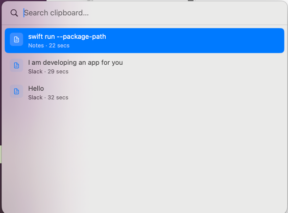

# PasterMind



A lightweight native macOS clipboard manager that lives in your menu bar.

Every time you copy something, PasterMind saves it. Open the history panel at any moment, search through past copies, and re-copy anything with a single click or keypress.

Built with Swift, SwiftUI, and AppKit. No Electron. No subscriptions. No cloud.

---

## What it does

- Monitors your clipboard in the background
- Stores a history of everything you copy (text)
- Lets you browse, search, and re-copy past items instantly
- Re-copied items return to the top of the history
- Shows the app you copied from and how long ago

---

## Prerequisites

- macOS 14 (Sonoma) or later
- Swift Command Line Tools installed (no Xcode required)

To check if Swift is available:

```bash
swift --version
```

If it is not installed, run:

```bash
xcode-select --install
```

---

## How to run

Clone the repository and navigate to the project folder:

```bash
git clone <repo-url>
cd paster-mind
```

Build and assemble the app bundle:

```bash
./build.sh
```

Open the app:

```bash
open ClipboardTimeline.app
```

You will see a clipboard icon appear in the menu bar. The app runs in the background — there is no Dock icon.

To rebuild after making changes, run `./build.sh` again and then `open ClipboardTimeline.app`.

---

## Usage

### Opening the history panel

- Click the clipboard icon in the menu bar and choose **Clipboard History**
- Or press **CMD + SHIFT + V** from any app

### Navigating

| Key | Action |
| --- | --- |
| `↑` / `↓` | Move selection up / down |
| `Enter` | Copy selected item and close |
| `ESC` | Clear search (if active), or close the panel |
| `CMD + SHIFT + V` | Toggle the panel open / closed |

### Mouse

- **Click** any item to copy it and close the panel

### Searching

Start typing immediately after opening the panel — the search field is focused automatically. Results filter in real time across both content and source app name. Search is case-insensitive.

### Re-copying

Selecting a past item and pressing Enter (or clicking) copies it to your clipboard. The item moves back to the top of the history on next open. No duplicates are created.

---

## Notes

- History is kept in memory and resets when the app quits. Persistent storage (SwiftData) is available in the Xcode build.
- The app uses Carbon's `RegisterEventHotKey` for the global shortcut — no Input Monitoring permission is required.
- Only text content is captured. Images, files, and other clipboard types are ignored for now.
